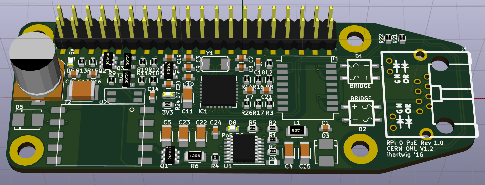

Raspberry Pi Zero PoE - PoEPi
=============================

This repository houses multiple designs for a PoE hat for RPi Zero that combines a 802.3af compliant controller with a 10Mbps ethernet controller/phy to provide power and connectivity over the same cable. The board shape matches RPi Zero, but this board should work on RPi 1/2/3 with 40-pin GPIO and the right headers. Footprints for the RPi Hat EEPROM are present but untested.

</img>

## Features
* 5V 12.95W 802.3af-compliant PoE with LTC4267
* 10Mbps ethernet using ENC28J60 (includes Raspbian driver support)

## Variations

* **passive-poe-only-top-smt**: Schematic only (layout abandoned) for an FRC Passive PoE (4-18V) variant using a TPS63070 buck-boost regulator
  * Ported sch, pcb, and libs to KiCAD 7.0.2
  * New project at https://github.com/ihartwig/ether-friends/tree/main/pizero-papoe
* **poe-only-top-smt**: Rev 2 with only PoE parts and all parts on top for easy automated assembly.
  * [Order bare pcbs from Dirty PCB](http://dirtypcbs.com/view.php?share=26685&accesskey=).
  * Known issues:
    * J1 TPIN+/- pair is on the wrong pins - no link up
    * PoE negotiation does not complete
* **servo-controller**: Rev 1 with buffered output to drive 3 servos.
* **speaker-amplifier**: Rev 1 with an amplifier for the RPi's PWM audio output.
* **ws2812-controller**: Rev 1 with a connector for NeoPixels.

## Raspberry Pi Zero - PoEPi

The Raspberry Pi Zero is a low power and low footprint Raspberry Pi. It gives people an opportunity to move towards compact connected devices
while moving away from being a just a small computer. PiPoE adds a new way of connecting the Raspberry Pi Zero with the world in a very efficient
manner. Power over Ethernet is a way if injecting power into an Ethernet cable without interfering with the data. What it gives you is a high 
reliability way of powering and communicating with the Raspberry Pi. The design of PoEPi is open source under the CERN OHL V1.2 and can be easily
adapted to your own custom designs. 

For more information check out the Wiki on github

### Basic Hardware usage

1. Setup your Raspberry Pi with a monitor and enable SSH with raspi-config
2. Plug Ethernet cable into a PoE switch or add a PoE injector somehwhere in you Ethernet line
3. Connect the PoEPi to the Raspberry Pi
4. Plug in the "injected" Ethernet cable
5. The Pi Zero should be powered and you then SSH into the Pi

For information on the particular PoEPi modules and how to control them please see the wiki on the github page 
